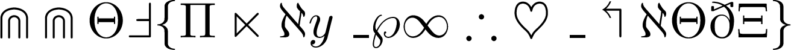

## Symbols - easy (unsolved)

* 這題算 misc 吧 (x
* 
* 參考 maple3142 大大寫的 [writeup](https://blog.maple3142.net/2021/08/01/cryptoctf-2021-writeups/)
* 用 [Detexify](https://detexify.kirelabs.org/classify.html) 找每個符號的 LaTeX command 把第一個字組起來就是 flag 了
* `CCTF{Play_with_LaTeX}`